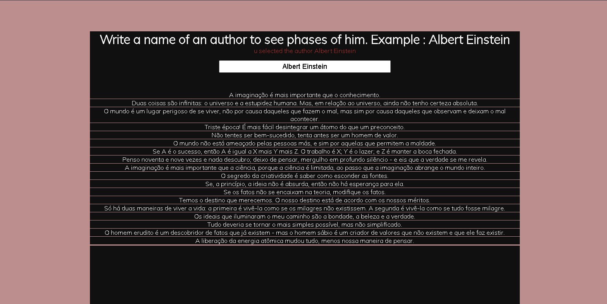

# API o pensador
> Com função de mostrar frases de autores .

 - Fonte : [o Pensador](https://www.pensador.com/)
 - Desenvolvido com: Jquery e Ajax (js e PHP) 
 - [Criador da API ](https://github.com/LuisAraujo/API-O-Pensador)
 
  > Imagem do Resultado de uma pesquisa , procurando o Albert Einstein .
 
